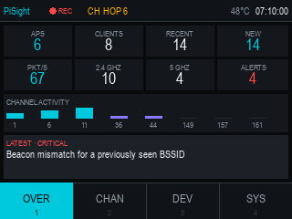
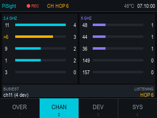
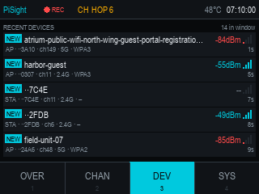
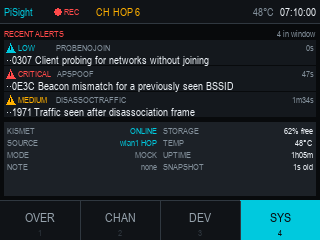

# PiSight

**A compact passive Wi-Fi reconnaissance dashboard for a Raspberry Pi 5 and a 320x240 display.**

PiSight turns a headless Pi running [Kismet](https://www.kismetwireless.net/) into a glanceable
field instrument. Four screens, a 320x240 SPI TFT, and everything you need to answer *what is on
the air here, and is anything wrong* without opening a laptop.

<p align="center">
  
  
</p>
<p align="center">
  
  
</p>

---

## Authorized and passive use only

> **PiSight observes. It never transmits.**
>
> Use it only on networks and in locations where the owner has authorized wireless observation.
> Passive Wi-Fi observation is regulated differently in different jurisdictions, and "I could
> receive it" is not the same as "I was permitted to". Get permission first, in writing, and know
> the rules that apply where you are.

PiSight does not implement, invoke, or provide a path to any of the following, and pull requests
adding them will be declined:

packet injection · deauthentication or disassociation · active probing · authentication attempts ·
network association · password or handshake cracking · credential collection · exploitation ·
spoofing · arbitrary shell commands from the UI · Kismet configuration changes · automatic upload
of observations · shutting down the host or deleting capture data

The Kismet integration is **read-only** and authenticates with a token holding Kismet's `readonly`
role. PiSight never asks for, needs, or stores the Kismet administrator password.

These are not just promises in a README. `tests/test_safety.py` parses the source tree and fails
the build if a shell invocation, an offensive tool reference, a raw-socket import, a Kismet write
endpoint, or a committed credential appears. The systemd unit additionally drops every Linux
capability and denies `AF_PACKET`, so the deployed process is **incapable** of opening a raw
socket even if its code were changed to try.

---

## What it does

PiSight is a **display and triage client**. Kismet remains the capture engine and the source of
truth; PiSight reads Kismet's REST API and draws the result.

| Screen | Answers |
|---|---|
| **Overview** | How much is out there? APs, clients, recent devices, devices new since startup, packet rate, 2.4/5 GHz split, alert count, a channel-activity strip, and the single most significant recent observation. |
| **Channels** | Where is the activity? Per-channel device counts for 2.4 GHz and 5 GHz side by side, with the channel the radio is currently tuned to marked. Read-only: PiSight cannot lock a channel. |
| **Devices** | What is here right now? The five most recently active devices with type, masked MAC, channel, band, security and signal. |
| **Alerts / System** | Is anything wrong? Recent Kismet alerts by severity, plus Kismet link state, datasource state, free storage, CPU temperature, uptime and snapshot age. |

---

## Architecture

```
                 ┌──────────────────────────────────────────┐
   Wi-Fi  ))) ──▶│ PAU0B adapter  ──▶  Kismet (capture)      │
                 └──────────────────────┬───────────────────┘
                                        │  REST, read-only, loopback
                                        ▼
       ┌────────────────────────────────────────────────────────────┐
       │ PiSight                                                    │
       │                                                            │
       │  ┌──────────────────┐        ┌──────────────────────────┐  │
       │  │ polling thread   │        │ render thread (30 FPS)   │  │
       │  │                  │        │                          │  │
       │  │ provider.fetch() │ ─────▶ │ store.get() ─▶ screens   │  │
       │  │ host health      │ latest │ status bar / nav bar     │  │
       │  │ backoff + retry  │  slot  │ input + touch debounce   │  │
       │  └──────────────────┘        └──────────────────────────┘  │
       │         ▲                                                  │
       │         │ DashboardProvider protocol                       │
       │   ┌─────┴──────┬──────────────┐                            │
       │   │ Kismet     │ Mock         │                            │
       │   └────────────┴──────────────┘                            │
       └────────────────────────────────────────────────────────────┘
```

Three properties hold this together:

1. **The UI never knows where data came from.** Screens receive an immutable
   `DashboardSnapshot` and nothing else, so the entire interface is developed and tested on a
   desktop with no radio attached.
2. **The render thread never does I/O.** All HTTP and filesystem work happens on one supervised
   background thread. Snapshots cross between them through a single-slot store: the renderer always
   draws the newest data, obsolete snapshots are discarded, and memory is constant no matter how
   far either side falls behind.
3. **Failure degrades, it does not crash.** A failed poll keeps the last known observations on
   screen, marks the link offline, and backs off exponentially with jitter. A malformed response
   is rejected rather than rendered as "nothing observed".

Full detail in [docs/ARCHITECTURE.md](docs/ARCHITECTURE.md).

---

## Quick start on your desktop

Requires **Python 3.11 or newer**. Nothing else — no radio, no Kismet, no Pi.

```bash
git clone https://github.com/DiegoDoug/pisight.git
cd pisight

python3 -m venv .venv
source .venv/bin/activate        # Windows: .venv\Scripts\Activate.ps1

python -m pip install -e ".[dev]"
```

### Mock mode

Mock mode is a full simulation, not placeholder text: realistic 2.4 and 5 GHz channel plans,
access points and clients, a drifting packet rate, moving signal levels, devices arriving over
time, and alerts across all five severities.

```bash
pisight --mode mock
```

A 960x720 window opens showing the 320x240 canvas at 3x, nearest-neighbour, so you see exactly
the pixels the TFT will show.

| Input | Action |
|---|---|
| `1` `2` `3` `4` | Jump to Overview / Channels / Devices / Alerts |
| `←` `→` | Previous / next screen (wraps) |
| Click or tap a nav button | Switch screen |
| `Esc` | Exit (windowed mode only) |

### Live mode

```bash
export PISIGHT_KISMET_API_TOKEN='your-readonly-token'
pisight --mode live
```

### Other commands

```bash
pisight doctor                              # read-only environment diagnostic
pisight doctor --json                       # same, machine-readable
pisight config                              # resolved settings (never the token)
pisight screenshots --output artifacts/screenshots
pisight --mode mock --smoke-seconds 5       # run for 5s and exit, for CI
```

### Development

```bash
ruff format --check . && ruff check . && mypy src && pytest
SDL_VIDEODRIVER=dummy pisight --mode mock --smoke-seconds 5
```

---

## Install on a Raspberry Pi 5

Full instructions, including the two display profiles, are in
[docs/RPI5_DEPLOYMENT.md](docs/RPI5_DEPLOYMENT.md). The short version:

```bash
ssh pi@raspberrypi.local

sudo apt update
sudo apt install -y git python3-venv python3-pip

git clone https://github.com/DiegoDoug/pisight.git
cd pisight

sudo bash scripts/install-rpi.sh --dry-run    # preview every action, change nothing
sudo bash scripts/install-rpi.sh              # apply
```

The installer creates an unprivileged `pisight` account, installs to `/opt/pisight` in its own
virtualenv, and writes config templates to `/etc/pisight`. It **does not** touch
`/boot/firmware/config.txt`, any display overlay, Kismet's configuration, any wireless interface,
or any capture data.

### Generate a read-only Kismet API key

PiSight cannot create this for you, and the installer will not invent one.

1. On the Pi, open `http://127.0.0.1:2501` in a browser and log in as your Kismet admin user.
2. Open the menu (top right) and choose **API Tokens**.
3. Create a token:
   - **Name:** `pisight`
   - **Role:** `readonly` — PiSight needs nothing more, and an `admin` token would hand any
     process that reads it full control of your capture engine
   - **User:** your Kismet user
4. Copy the generated token.

### Environment setup

```bash
sudo nano /etc/pisight/pisight.env
```

```bash
PISIGHT_KISMET_API_TOKEN=paste_your_readonly_token_here
PISIGHT_MODE=live
```

This file is `root:root` mode `0600`. systemd reads it as root and hands the value to the
unprivileged process, so the token is never readable on disk by the `pisight` account, never
appears in `config.toml` (which is world-readable), and never enters a URL, a log line or a
screenshot.

```bash
bash scripts/verify-rpi.sh                   # read-only post-install checks
sudo systemctl enable --now pisight.service
journalctl -u pisight -f
```

---

## Configuration

Configuration is resolved in this order, first hit wins:

1. the path given to `--config`
2. `$PISIGHT_CONFIG`
3. `/etc/pisight/config.toml`
4. packaged safe defaults

Environment variables override the file; `--mode` overrides everything. See
[`config/pisight.example.toml`](config/pisight.example.toml), which documents every setting and
matches the defaults exactly.

Defaults are deliberately conservative: 320x240, 30 FPS, mock mode, loopback Kismet, no GPS, no
uploads, MAC addresses masked to their last four hex characters, and no automatic deletion of
anything. `enable_gps` and `allow_uploads` are validated as `false` — PiSight refuses to start
otherwise.

---

## Troubleshooting

**The screen is blank on the Pi.** Almost always the SDL video driver. Check which deployment
profile applies (`docs/RPI5_DEPLOYMENT.md`), then try `SDL_VIDEODRIVER=kmsdrm` in
`/etc/pisight/pisight.env`. Confirm the `pisight` user is in the `video` and `input` groups:
`id pisight`.

**Status bar shows OFFLINE.** Kismet is unreachable. `systemctl status kismet`, then
`curl -s http://127.0.0.1:2501/system/timestamp.json`. PiSight keeps running and keeps showing the
last data it had — that is intended behaviour, not a hang.

**Status bar shows STALE.** Snapshots are arriving but slowly, or have stopped. Check the Pi's
load; Kismet under heavy traffic can be slow to answer.

**Live mode exits with a token error.** `PISIGHT_KISMET_API_TOKEN` is unset or empty. PiSight
deliberately refuses to fall back to mock data here: showing synthetic observations to someone who
asked for live ones would be dangerous.

**Kismet returns 401/403.** The token is wrong, expired, or was deleted in the Kismet UI. Generate
a new one with the `readonly` role.

**The touchscreen does nothing.** `ls /dev/input/event*` and confirm `pisight` is in the `input`
group. PiSight has a 220 ms touch debounce; a single press changing one screen is correct.

**Text looks wrong or boxy.** DejaVu Sans is missing. `sudo apt install fonts-dejavu-core`.
PiSight falls back to a built-in font rather than failing, so this is cosmetic.

`pisight doctor` reports on all of the above at once, and changes nothing while doing it.

---

## Known limitations

**Radio and capture**

- **One PAU0B listens on exactly one channel at a time.** It is a single-radio adapter. It cannot
  observe 2.4 GHz and 5 GHz simultaneously, and it cannot watch two channels at once.
- **Channel hopping creates observation gaps.** While Kismet has the radio parked on channel 6, it
  is deaf to every other channel. Anything transmitted elsewhere in that interval is simply never
  seen. Counts on the Channels screen are therefore a *sample*, not a census, and comparing two
  channels compares two different slices of time. A device can be present and completely absent
  from PiSight's display.
- **Wi-Fi payloads are usually encrypted.** On a WPA2/WPA3 network the data you might care about is
  unreadable. What is observable is mostly unencrypted management and control frames, plus traffic
  metadata: who is present, on what channel, how strong, how loud. PiSight shows exactly that and
  never attempts to decrypt anything.
- **The PAU0B cannot observe 6 GHz.** Any 6 GHz record folds into the 5 GHz figures.
- **Signal strength is not distance.** dBm varies with antenna orientation, obstruction and
  transmit power. Treat it as a coarse proximity hint only.

**Application**

- **"New" means new to this PiSight process, not new to Kismet.** PiSight has no persistent store.
  **The new-device counter resets to zero every time PiSight restarts**, including after a service
  restart or a reboot. It answers "what has appeared since I started watching", nothing more.
- The Devices screen shows five devices at a time. That is a deliberate legibility limit on a
  320x240 panel, not pagination; there is no way to scroll to a sixth.
- Devices and alerts are bounded to a recent time window and hard client-side caps, so a very busy
  environment is sampled rather than shown exhaustively.
- PiSight is read-only in both directions: it cannot change Kismet, and it cannot export anything.
- No GPS, no logging to disk, no historical view. Kismet already stores history; use its own UI.
- **The display, touch input and USB adapter have not been validated on real hardware.** See below.

---

## Hardware validation status

> **NOT YET VERIFIED ON REAL HARDWARE.**
>
> Everything in this repository was developed and tested on a desktop with the SDL dummy video
> driver. The full test suite, the four screens, the Kismet parsers and the deployment assets all
> pass in that environment. **No part of this has run on a Raspberry Pi 5, an ILI9341 display, an
> XPT2046 touch panel or a Panda PAU0B adapter.**
>
> Claims about display output, touch responsiveness, capture behaviour and on-Pi performance are
> *designed intent*, not measured fact.

[**docs/HARDWARE_VALIDATION.md**](docs/HARDWARE_VALIDATION.md) is the checklist to work through at
the Pi to close that gap.

---

## Documentation

| Document | Contents |
|---|---|
| [ARCHITECTURE.md](docs/ARCHITECTURE.md) | Module layout, threading model, data flow |
| [PRODUCT_SCOPE.md](docs/PRODUCT_SCOPE.md) | What PiSight is and is not, and why |
| [THREAT_MODEL.md](docs/THREAT_MODEL.md) | Assets, adversaries, mitigations |
| [SECURITY.md](SECURITY.md) | Security policy and reporting |
| [RPI5_DEPLOYMENT.md](docs/RPI5_DEPLOYMENT.md) | Full Pi install, both display profiles |
| [HARDWARE_VALIDATION.md](docs/HARDWARE_VALIDATION.md) | The on-hardware checklist |
| [ROLLBACK.md](docs/ROLLBACK.md) | How to undo the installation completely |
| [DECISIONS.md](docs/DECISIONS.md) | Design decisions and their rationale |
| [MVP_ACCEPTANCE.md](docs/MVP_ACCEPTANCE.md) | Requirement-by-requirement acceptance record |

---

## License

MIT. See [LICENSE](LICENSE).

PiSight is a client for Kismet and is not affiliated with or endorsed by the Kismet project.
